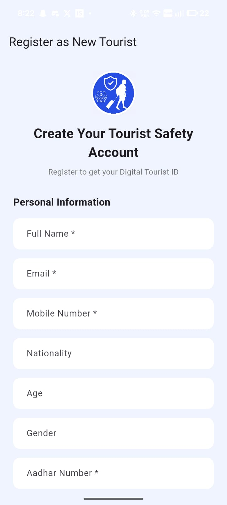
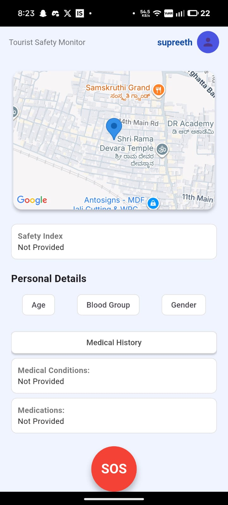
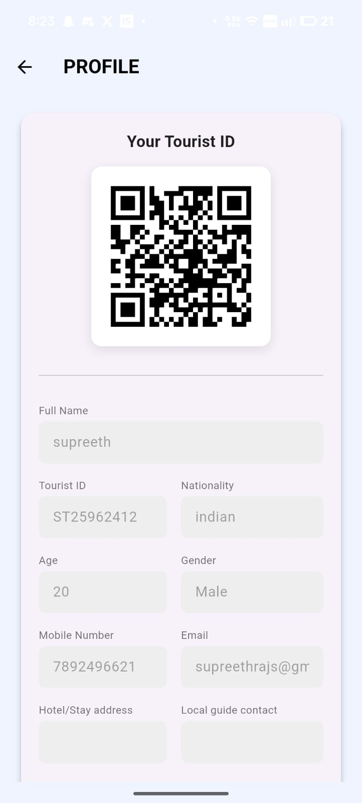

# 🛡️ Suraksha-Setu: Tourist Safety Monitoring System

> **Smart India Hackathon (SIH) 2025 Prototype** > *Bridging the gap between exploration and safety.*

[](https://flutter.dev)
[](https://dart.dev)
[](https://sih.gov.in)
[](https://opensource.org/licenses/MIT)

## 📖 Overview

**Suraksha-Setu** is a cross-platform mobile application developed to ensure the safety of tourists in unfamiliar regions. Built for **Smart India Hackathon 2025**, the app provides real-time monitoring, risk assessment, and immediate emergency response mechanisms.

By leveraging **Google Maps API** for geolocation and **Blockchain** for secure digital identities, Suraksha-Setu acts as a digital guardian for travelers, providing peace of mind to both the tourist and their family members.

---

## ✨ Key Features

### 🚨 Emergency Response (SOS)
* **One-Tap SOS:** Prominent red SOS button on the dashboard for immediate activation.
* **Live Location Sharing:** Instantly sends current coordinates to registered emergency contacts.
* **Visual Feedback:** Toast notifications confirm when the SOS signal has been successfully transmitted.

### 🗺️ Real-Time Monitoring & Geo-Fencing
* **Live Tracking:** Integrated **Google Maps** view to track the user's current location.
* **Safety Index:** (Prototype) Displays a calculated safety score for the current location based on historical data and crowd-sourced inputs.
* **Geo-Fencing:** Alerts users when they enter designated "High Risk" zones.

### 🆔 Secure Digital Identity
* **Tourist ID Generation:** Auto-generates a unique `Tourist ID` (e.g., `ST25962412`) upon registration.
* **QR Code Profile:** A scannable QR code containing the tourist's profile and medical details for quick access by authorities in case of emergency.
* **Blockchain Integration:** Uses decentralized identifiers (DID) to prevent identity theft and ensure data privacy.

### 📝 User Management
* **Comprehensive Registration:** Captures vital details including Medical History, Blood Group, and Aadhar Number.
* **Secure Authentication:** Email verification via OTP (One-Time Password).
* **Emergency Contacts:** Mandatory linking of next-of-kin details (Name, Phone, Relation).

---

## 📱 App Screenshots

| Registration & OTP | Dashboard & Map | SOS & Profile |
|:---:|:---:|:---:|
|  |  |  |

> *Note: Replace the paths above with the actual paths to your screenshots in the repo.*

---

## 🛠️ Tech Stack

* **Frontend:** [Flutter](https://flutter.dev/) (Dart)
* **State Management:** Provider
* **Maps & Location:** Google Maps API, Geolocator
* **Backend & Auth:** Firebase (Auth, Firestore), Python (Flask)
* **Security:** Blockchain (for Digital Identity/DID)
* **Other Tools:** Clipchamp (Demo Video), VS Code

---

## 🚀 Getting Started

### Prerequisites
* Flutter SDK installed (v3.0 or higher)
* Dart SDK
* Android Studio / VS Code
* Google Maps API Key

### Installation

1.  **Clone the repository**
    ```bash
    git clone [https://github.com/your-username/suraksha-setu.git](https://github.com/your-username/suraksha-setu.git)
    cd suraksha-setu
    ```

2.  **Install Dependencies**
    ```bash
    flutter pub get
    ```

3.  **Configure Google Maps**
    * Create a file `android/app/src/main/AndroidManifest.xml`.
    * Add your API key inside the application tag:
        ```xml
        <meta-data android:name="com.google.android.geo.API_KEY"
                   android:value="YOUR_API_KEY_HERE"/>
        ```

4.  **Run the App**
    ```bash
    flutter run
    ```

---

## 🔮 Future Roadmap

* [ ] **AI-Powered Safety Scoring:** Integrate Machine Learning to predict safety scores based on real-time crime data and weather conditions.
* [ ] **Offline Mode:** Enable SOS functionality via SMS when internet data is unavailable.
* [ ] **Language Support:** Multi-language support for international tourists.
* [ ] **Crowdsourced Reporting:** Allow users to report incidents to update the safety heatmap in real-time.

---

## 👥 Team Codeshack

Built with ❤️ by **Team Codeshack**.

* **Supreeth** - App Development & API Integration
* *[Teammate Name]* - Backend & Blockchain
* *[Teammate Name]* - UI/UX Design

---

## 📄 License

This project is licensed under the MIT License - see the [LICENSE](LICENSE) file for details.

